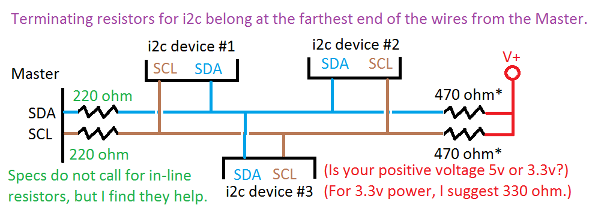

# Potager Connecté

Source code for ESP8266 that reports values to [prometheus](https://prometheus.io/) and visualize then on [grafana](https://grafana.com/).

## Wiring

On nodemcu v3, you must:
- Plug i2c sensors on:
  - SDA = D4
  - SCL = D5
- add pull-up resistors on those 2 pins

    [i2c pull up resistors](https://create.arduino.cc/projecthub/consoleteam/multiple-mode-environmental-sensor-deck-with-mkr1000-f184a6)

    

## Thanks

Code inspired from: <https://github.com/HON95/prometheus-esp8266-dht-exporter/>
